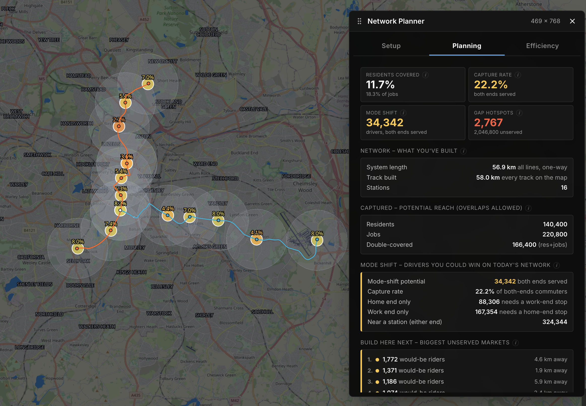
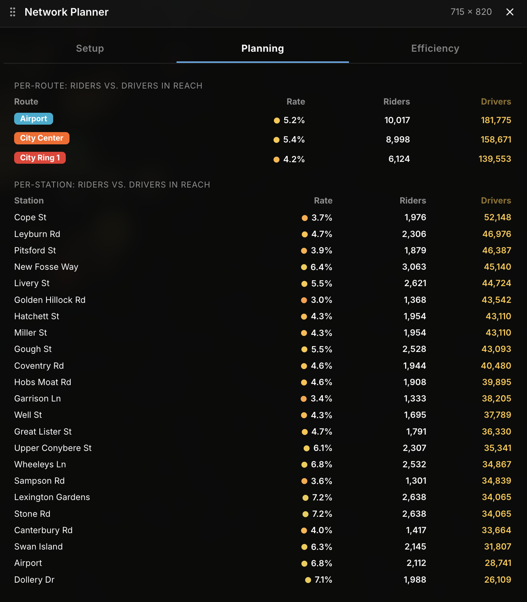
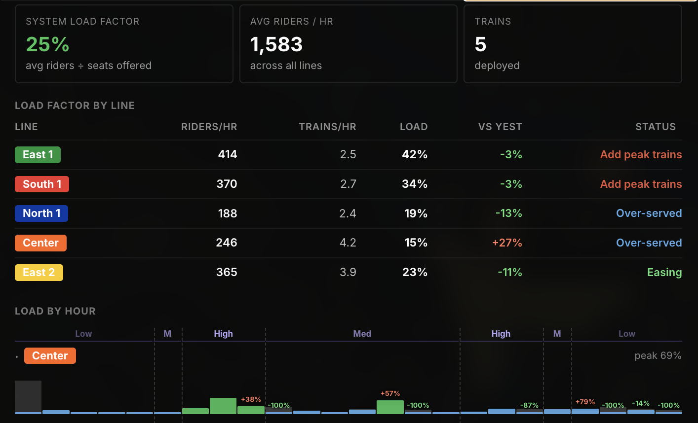
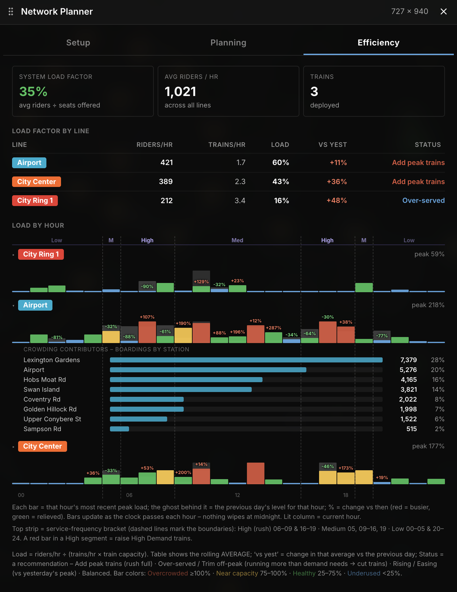
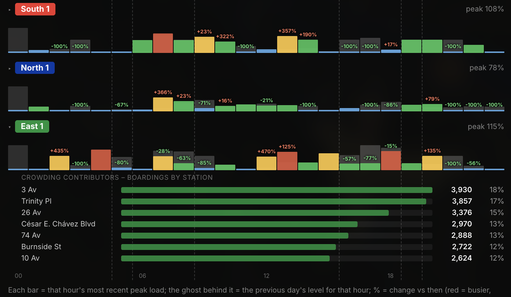
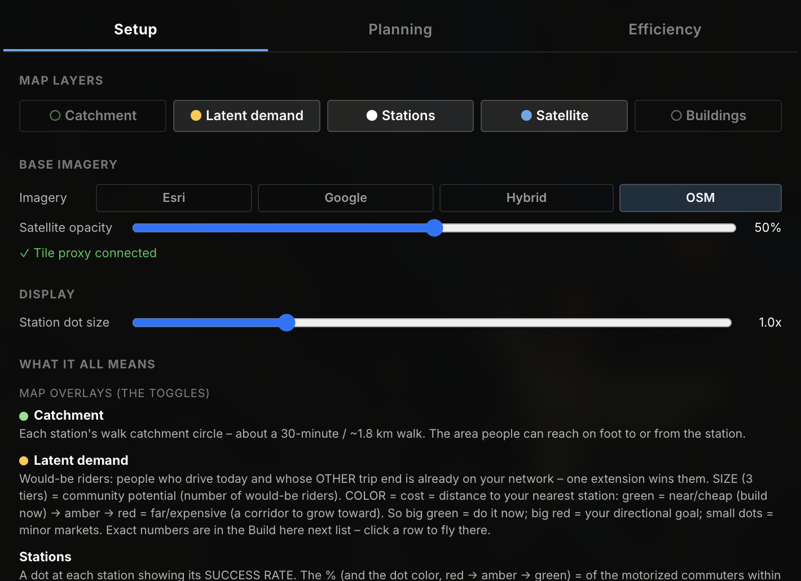
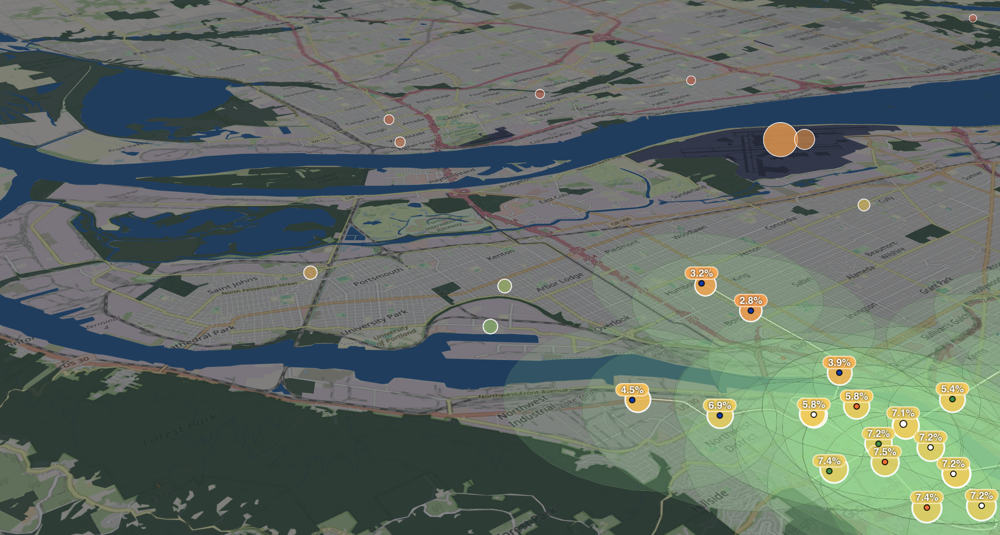

# Network Planner

A planning and analytics suite for [Subway Builder](https://www.subwaybuilder.com). It reads the game's real demand grid and live line metrics to show where to expand, which lines need trains, when, and where crowding comes from.

[](https://github.com/davidkarpik/network-planner/releases/latest)
[](https://github.com/davidkarpik/network-planner/releases)
[](LICENSE)


---

## What it does

Network Planner adds a three-tab panel alongside the game. The analysis works with zero setup: no dependencies, no account, no key.

### Planning: where to grow

- Walk catchments with a real coverage percentage of residents and jobs actually within reach.
- Mode-shift potential: drivers whose home and work are both reachable. Your genuinely winnable market, not a vanity number.
- A ranked "Build here next" list of the biggest unserved markets. Click a row to fly straight there.
- Per-route and per-station riders versus drivers, with success-rate dots on the map.






### Efficiency: how well it runs

- Per-line Load Factor with plain-English advice (Add peak trains, Trim off-peak, Over-served, Rising or Easing vs yesterday, Balanced).
- Load-by-hour charts showing exactly which hours each line overcrowds, with a day-over-day comparison, a current-hour marker, and the game's High/Medium/Low service brackets marked.
- Expand any line for its crowding contributors, the busiest boarding stops. Click one to fly there.
- Remembers your data per save, so it is never blank on reload.







### Setup

Layer toggles, key-free satellite imagery (Esri, Google, Hybrid, OSM), opacity, and station-dot size, plus an inline glossary explaining every concept.



---

### Concepts explained

| Term | What it means |
|---|---|
| Coverage % | Share of the whole city's residents (and jobs) within walking reach of any station, counted once. |
| Catchment | Each station's walk circle, about a 30-minute or 1.8 km walk. The area people can reach on foot to or from the station. |
| Mode-shift potential | Drivers whose home and work both fall within a catchment. The riders you can win on today's network. |
| Latent demand | Would-be riders who drive today and whose other trip end is already on your network, so one extension wins them. Dot size is how many; dot color is distance to your nearest station (green means build now, red means a corridor to grow toward). |
| Station transit share | Of the motorized commuters near a station, the share who already ride instead of drive (the dot's percentage and color). Low means lots of nearby drivers not yet won. |
| Load Factor | riders/hr divided by (trains/hr times train capacity). Shown as the rolling average across the day; the status uses the peak hour, so rush overcrowding is never hidden. |
| vs yest | Day-over-day change in a line's average load. |
| Crowding contributors | The busiest boarding stops on overcrowded lines, where to add trains or build a relief line. (Boardings are where demand originates; the game does not expose on-board segment occupancy.) |

---

## Installation

### Railyard mod manager (once listed)

Install the [Railyard](https://subwaybuildermodded.com/railyard/) mod manager and search for "Network Planner".

### Manual (GitHub)

1. Create a `network-planner` folder in your mods directory (Main Menu > Settings > Mods).
2. Download the [latest ZIP from the releases page](https://github.com/davidkarpik/network-planner/releases/latest).
3. Extract the ZIP contents into the `network-planner` folder.
4. Restart the game and activate Network Planner.

The Planning and Efficiency tabs work immediately. No setup, no dependencies, no key.

### Satellite imagery (optional)

Satellite is the only feature that needs anything extra. The game blocks external tile domains, so tiles are served from a tiny local proxy on `127.0.0.1`. It requires [Node.js](https://nodejs.org). All four providers are key-free.

macOS, run once and it auto-starts at login:

```bash
bash install-proxy.sh
```

(from the mod folder; remove with `bash install-proxy.sh --uninstall`)

Windows, register once:

```powershell
schtasks /create /tn NetworkPlannerSatProxy /tr "node \"%APPDATA%\metro-maker4\mods\network-planner\proxy.js\"" /sc onlogon /f
```

Any OS, each session:

```bash
node proxy.js
```

The Setup tab shows whether the proxy is connected and guides you if it is not.

Provider note: Esri World Imagery and OpenStreetMap are licensed for use; the Google endpoints are unofficial, fine for personal play, which is why Esri is the default.



---

## Contributing

Bug reports and ideas are very welcome.

- Found a bug? [Open an issue](https://github.com/davidkarpik/network-planner/issues/new) with steps to reproduce and your game version.
- Have an idea? Open an issue to discuss it before sending a PR.

### Useful links

|  |  |
|---|---|
| Subway Builder | [subwaybuilder.com](https://www.subwaybuilder.com) |
| Official API docs | [subwaybuilder.com/docs](https://www.subwaybuilder.com/docs/) |
| Community modding | [subwaybuildermodded.com](https://subwaybuildermodded.com/) |

---

## License

[MIT](LICENSE), 2026 David Karpik.
